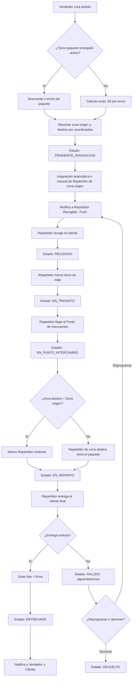
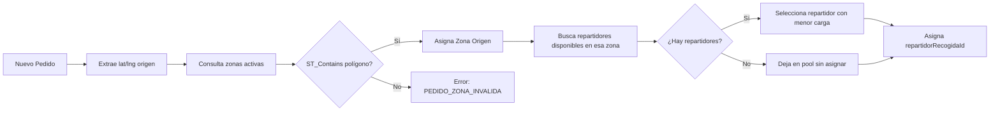
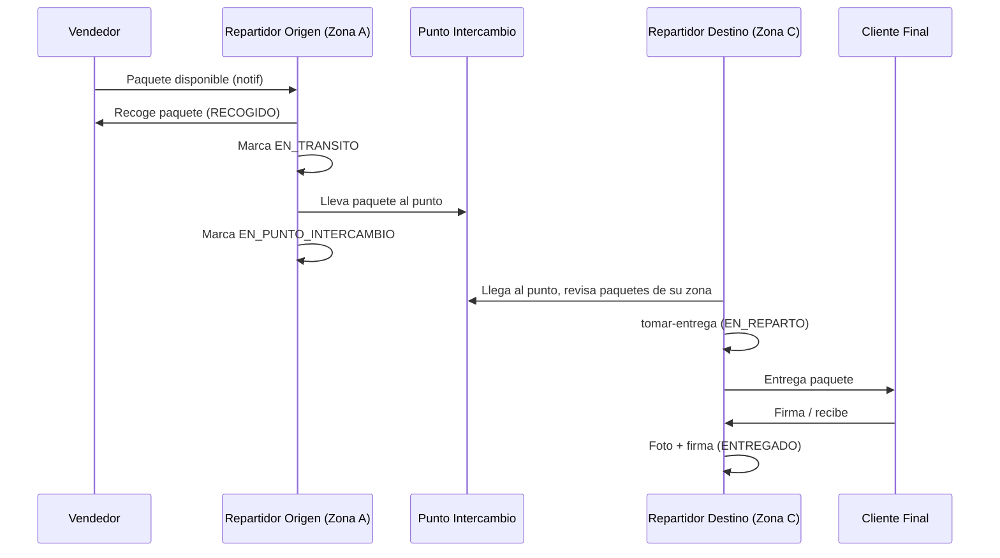
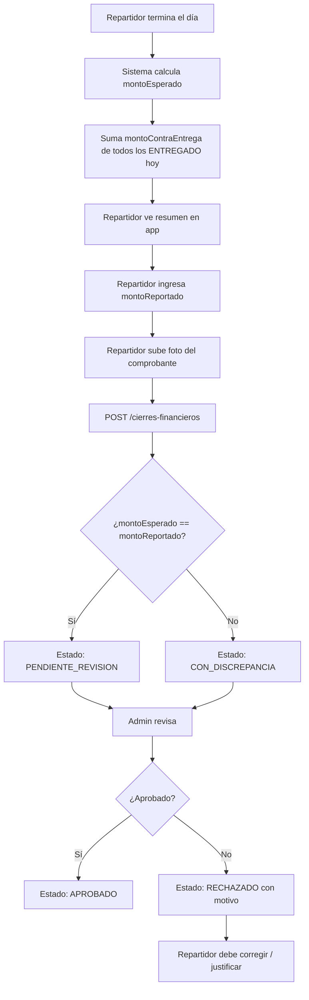
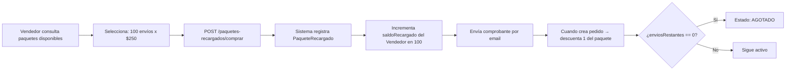
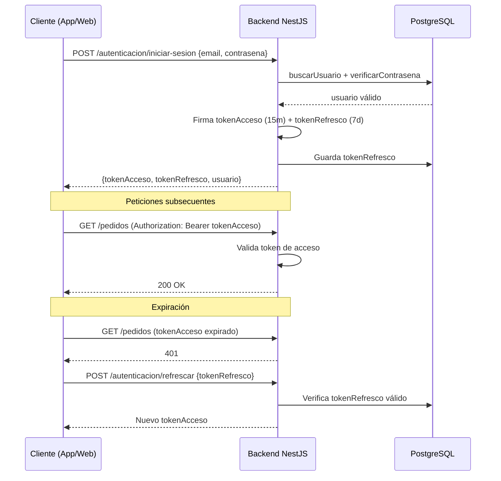
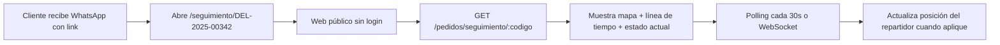
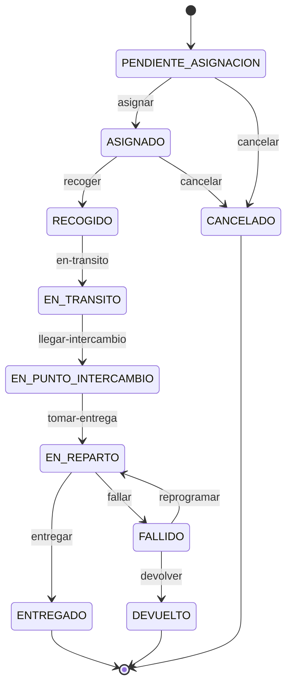
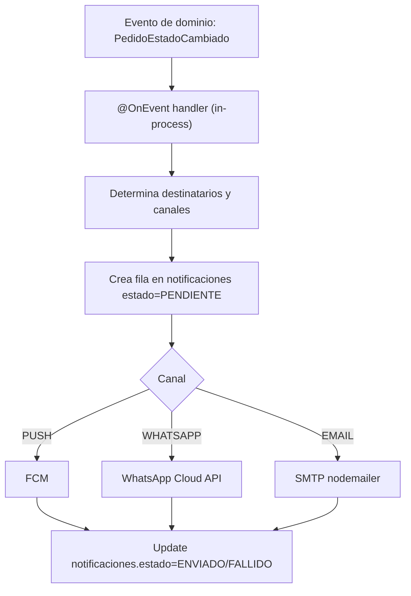

# Flujos de Trabajo

Este documento describe los flujos operativos principales del sistema usando diagramas Mermaid y descripciones paso a paso.

## 1. Flujo Completo de un Pedido



### Descripción detallada

| # | Paso | Actor | Estado resultante |
|---|------|-------|-------------------|
| 1 | Crear pedido | Vendedor | `PENDIENTE_ASIGNACION` |
| 2 | Asignar repartidor (auto/manual) | Admin / Sistema | `ASIGNADO` |
| 3 | Recoger paquete en tienda | Repartidor origen | `RECOGIDO` |
| 4 | Marcar inicio de viaje al punto de intercambio | Repartidor origen | `EN_TRANSITO` |
| 5 | Llegar a punto de intercambio | Repartidor origen | `EN_PUNTO_INTERCAMBIO` |
| 6 | Repartidor destino lo toma | Repartidor destino | `EN_REPARTO` |
| 7 | Entrega efectiva | Repartidor destino | `ENTREGADO` |
| 7b | Entrega fallida | Repartidor destino | `FALLIDO` |
| 8 | Devolución al vendedor | Repartidor | `DEVUELTO` |

> **Nota sobre `EN_TRANSITO`**: es un estado **obligatorio** entre `RECOGIDO` y `EN_PUNTO_INTERCAMBIO`. El repartidor lo dispara con `POST /pedidos/:id/en-transito` al iniciar el trayecto. Habilita la notificación al cliente "tu pedido está en camino" (ver `NOTIFICACIONES.md` evento `PEDIDO_EN_TRANSITO`).
>
> **Cancelaciones**: solo permitidas desde `PENDIENTE_ASIGNACION` o `ASIGNADO`. Una vez en `RECOGIDO` o posterior, el flujo termina en `ENTREGADO`, `FALLIDO` o `DEVUELTO` — no hay transición a `CANCELADO`.

---

## 2. Flujo de Asignación por Zonas



**Algoritmo de selección de repartidor**:
1. Filtrar repartidores de la zona con `disponible = true`.
2. Ordenar por cantidad de pedidos activos (`RECOGIDO` + `EN_TRANSITO`) ascendente.
3. Desempate: mejor `calificacion`.
4. Si todos están saturados (> 15 pedidos activos), encolar para reintento.

---

## 3. Flujo de Recolección y Redistribución



---

## 4. Flujo de Cierre Financiero Diario



**Reglas**:
- Solo 1 cierre por repartidor por día (índice único en BD).
- Si hay discrepancia, el admin puede:
  - Aprobar con nota (ej: el repartidor pagó la diferencia).
  - Rechazar y pedir corrección.
  - Escalar a RR.HH. si es recurrente.

---

## 5. Flujo de Compra de Paquete Prepago



### Lógica de cobro al crear pedido

```typescript
async function resolverFacturacion(vendedor: PerfilVendedor) {
  const paqueteActivo = await prisma.paqueteRecargado.findFirst({
    where: { vendedorId: vendedor.id, estado: 'ACTIVO', enviosRestantes: { gt: 0 } },
    orderBy: { compradoEn: 'asc' }, // FIFO
  });

  if (paqueteActivo) {
    return {
      modoFacturacion: 'PAQUETE',
      paqueteRecargadoId: paqueteActivo.id,
      costoEnvio: 0,
    };
  }

  return {
    modoFacturacion: 'POR_ENVIO',
    costoEnvio: 3.00, // vendrá de ReglaTarifa
  };
}
```

---

## 6. Flujo de Autenticación (JWT)



---

## 7. Flujo de Tracking Público (Cliente Final)



---

## 8. Máquina de Estados de Pedido (Transiciones Válidas)



**Tabla de transiciones permitidas**:

| Desde | Hacia | Quién puede |
|-------|-------|-------------|
| PENDIENTE_ASIGNACION | ASIGNADO | Admin / Sistema |
| PENDIENTE_ASIGNACION | CANCELADO | Vendedor / Admin |
| ASIGNADO | RECOGIDO | Repartidor asignado |
| ASIGNADO | CANCELADO | Vendedor / Admin |
| RECOGIDO | EN_TRANSITO | Repartidor origen |
| EN_TRANSITO | EN_PUNTO_INTERCAMBIO | Repartidor origen |
| EN_PUNTO_INTERCAMBIO | EN_REPARTO | Repartidor destino |
| EN_REPARTO | ENTREGADO | Repartidor destino |
| EN_REPARTO | FALLIDO | Repartidor destino |
| FALLIDO | EN_REPARTO | Admin / Repartidor |
| FALLIDO | DEVUELTO | Admin / Repartidor |

Cualquier otra transición debe rechazarse con `PEDIDO_TRANSICION_INVALIDA`. En particular: no se permite cancelar (`→ CANCELADO`) desde `RECOGIDO`, `EN_TRANSITO`, `EN_PUNTO_INTERCAMBIO` ni `EN_REPARTO`; estos casos deben resolverse vía `FALLIDO → DEVUELTO`.

---

## 9. Flujo de Notificaciones



> Sin colas (BullMQ removido). El envío ocurre en el mismo proceso que dispara el evento; si falla queda como `FALLIDO` en BD para reintento manual o por job programado.

### Matriz de Notificaciones

| Evento | Vendedor | Repartidor | Cliente Final | Admin |
|--------|----------|------------|---------------|-------|
| Pedido creado | Email | - | WhatsApp + link seguimiento | - |
| Pedido asignado | Push | Push | - | - |
| Recogido | Push | - | WhatsApp + Push | - |
| En tránsito | - | - | Push/WhatsApp | - |
| Entregado | Push + Email | - | Email | - |
| Fallido | Push | - | WhatsApp | Push |
| Discrepancia cierre | - | Push | - | Push + Email |

---

> Ver también: [`API_ENDPOINTS.md`](./API_ENDPOINTS.md) para los endpoints que disparan cada flujo.
